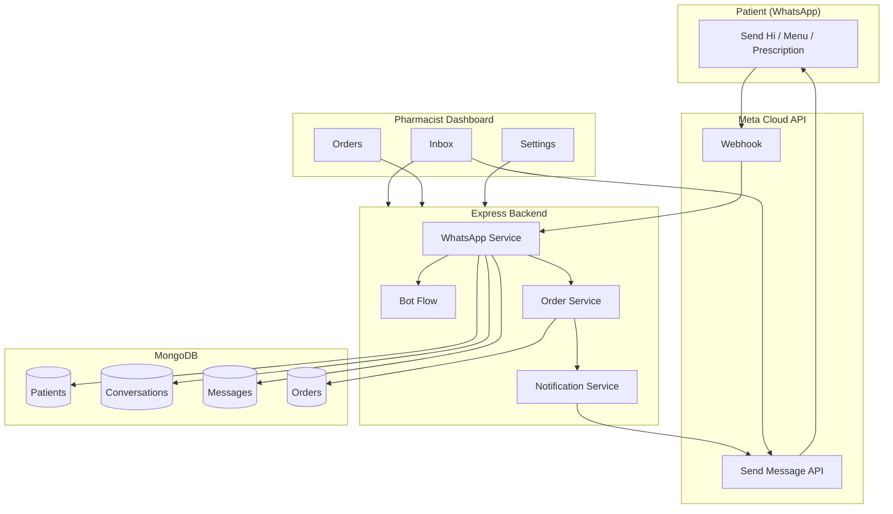
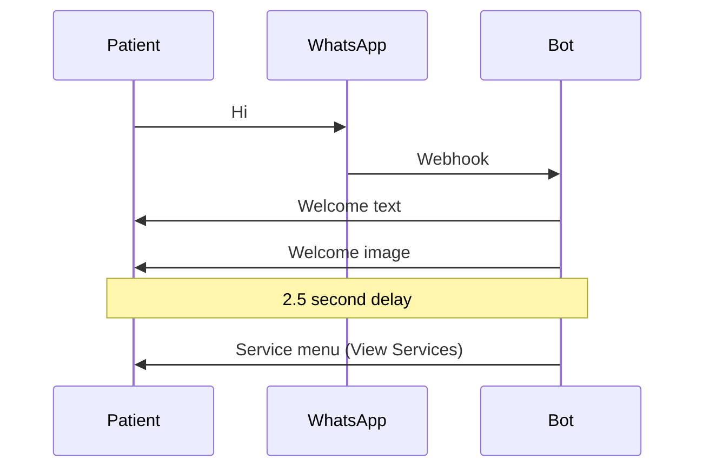
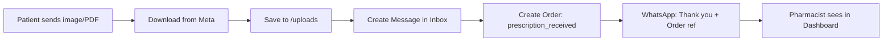
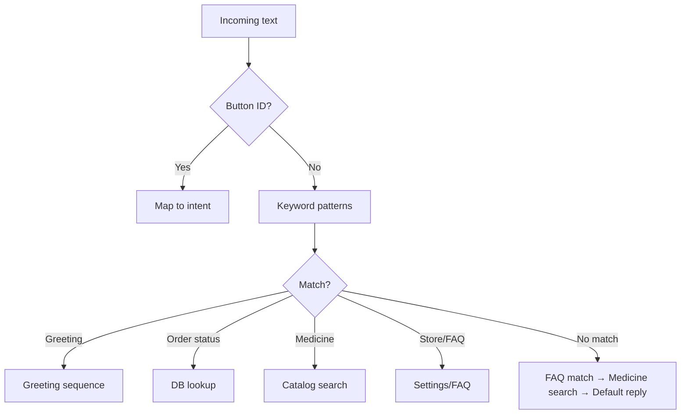
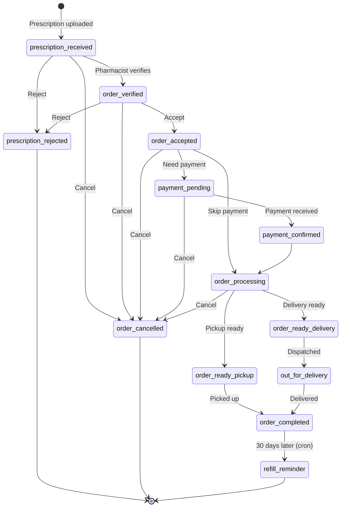
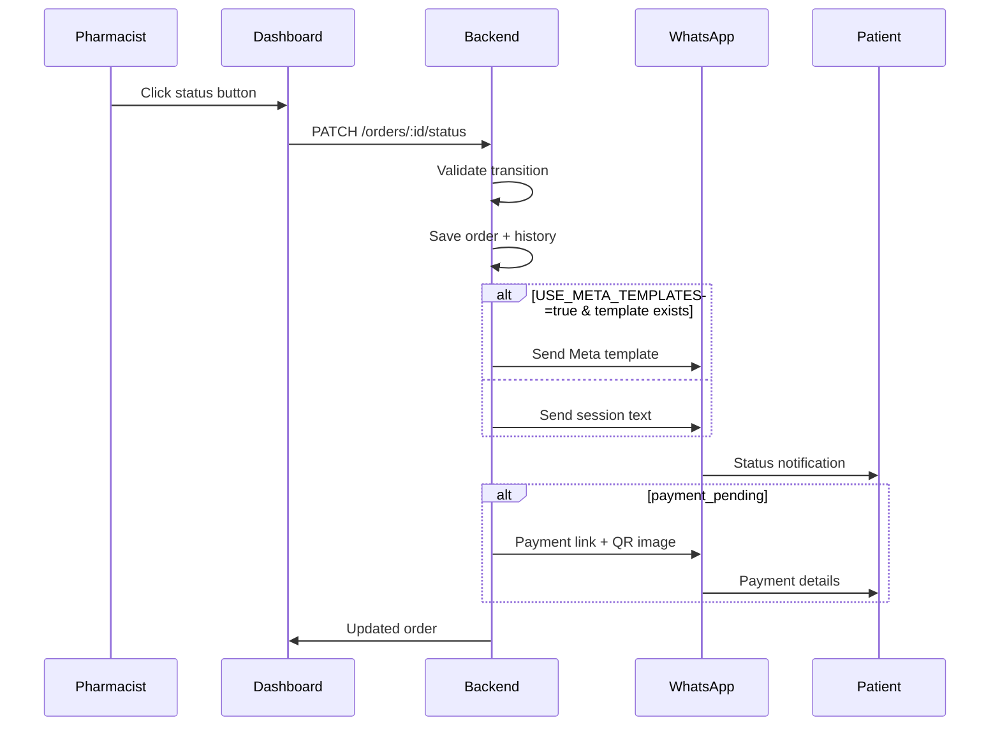
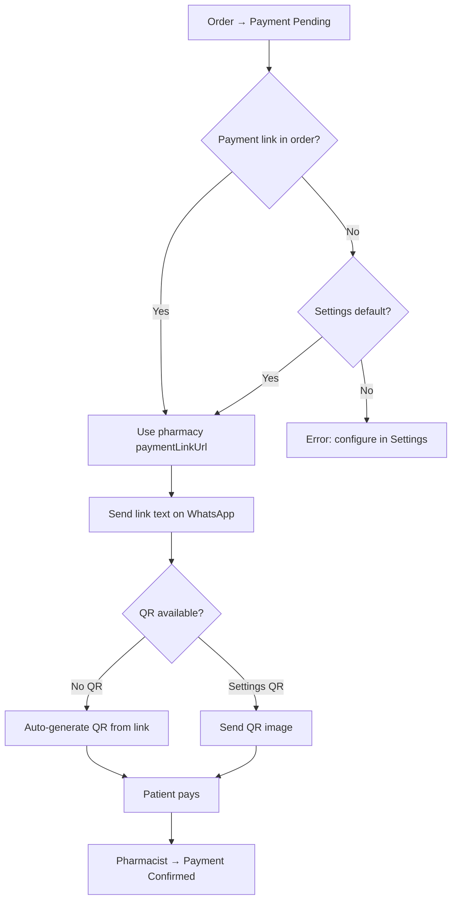
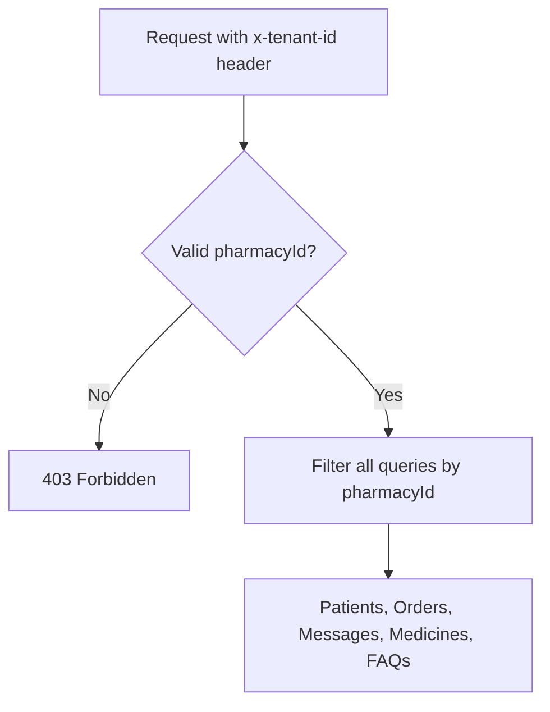
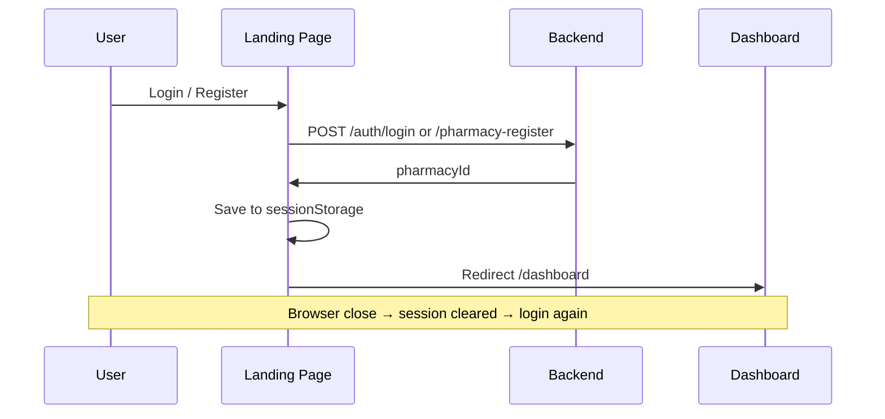

# Flow Structure Document
## BTbiz Pharmacy WhatsApp Communication System

---

## 1. System Overview



---

## 2. Patient WhatsApp Bot Flow

### 2.1 Greeting flow (patient sends "Hi")



### 2.2 Service menu options

| # | Menu option | Bot action |
|---|-------------|------------|
| 1 | Upload Prescription | Ask for photo/PDF |
| 2 | Order Status | Show latest order status |
| 3 | Refill Medicine | Ask for prescription or medicine names |
| 4 | Check Medicine | Ask for medicine name → stock & price |
| 5 | Repeat Last Order | Create new order from last prescription |
| 6 | Store Location | Show address, hours, map link |
| 7 | FAQ Support | List all FAQs |
| 8 | Talk to Pharmacist | Notify team; patient can type question |

### 2.3 Prescription upload flow



**Note:** No bot menu reply after prescription — order notification only.

### 2.4 Intent detection (text messages)



---

## 3. Order Lifecycle Flow

### 3.1 Status transition diagram



### 3.2 Notification on status change



---

## 4. Payment Flow



---

## 5. Dashboard Data Flow

```mermaid
flowchart LR
    subgraph Pages
        O[Overview]
        I[Inbox]
        OR[Orders]
        M[Medicines]
        S[Settings]
        PT[Patients]
    end

    subgraph APIs
        A1[/orders/stats]
        A2[/conversations + /messages]
        A3[/orders]
        A4[/medicines]
        A5[/pharmacies + /faqs]
        A6[/patients]
    end

    O --> A1
    I --> A2
    OR --> A3
    M --> A4
    S --> A5
    PT --> A6
```

---

## 6. Multi-Tenant Flow



Each pharmacy has:
- Own WhatsApp `phone_number_id`
- Own patients, conversations, orders
- Own settings (payment, store, greeting, FAQs)

---

## 7. Refill Reminder Flow (Cron)

```
Daily 9:00 AM
    ↓
Find orders: status = order_completed
    AND refillDueAt <= today
    AND refillReminderSentAt is null
    ↓
For each order → send refill_reminder WhatsApp message
    ↓
Set refillReminderSentAt = now
```

---

## 8. Meta Template Flow (Optional)

**When:** `USE_META_TEMPLATES=true` AND template status = **Approved** on Meta

| Order status | Template name |
|--------------|---------------|
| order_verified | `order_verified` |
| prescription_rejected | `prescription_rejected` |
| order_accepted | `order_accepted` |
| order_ready_pickup | `order_ready_pickup` |
| order_ready_delivery | `order_ready_delivery` |
| order_cancelled | `order_cancelled` |
| order_completed | `order_completed` |
| payment_confirmed | `payment_confirmed` |
| refill_reminder | `refill_reminder` |

**Fallback:** If template send fails → session text from `order-notification.service.ts`

**Not using templates:** Bot greeting, menu, prescription_received, payment_pending, pharmacist manual replies

---

## 9. File / Media Flow

```
WhatsApp media (prescription)
    → Meta media API download
    → Backend/uploads/prescriptions/{pharmacyId}/
    → URL saved in Message.content
    → Dashboard Inbox: Open / Download

Settings image upload (QR, greeting)
    → POST /pharmacies/:id/upload-asset
    → Backend/uploads/
    → URL saved on pharmacy record
```

---

## 10. Authentication Flow


